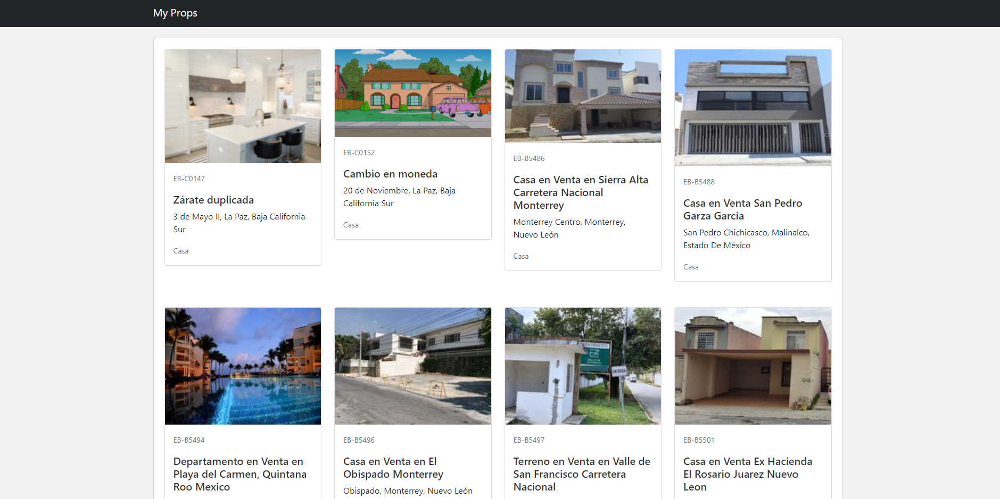
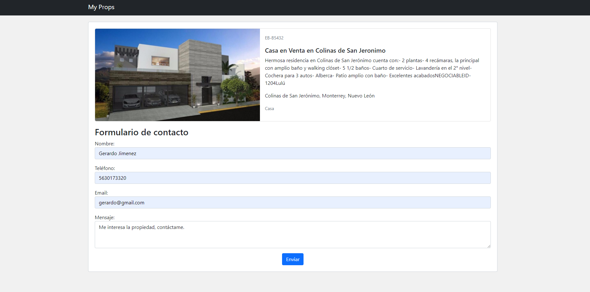
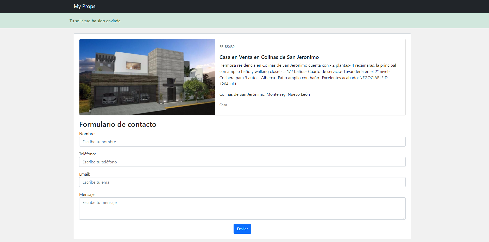

# My Props

## Prerrequisitos
- Instalar python, preferentemente 3.7 o mayor.
- Crear un nuevo entorno virtual

> Las instrucciones son para sistemas linux.

El sistema tendrá que correr en un entorno virtual provisto por la herramienta virtualenv, sin embargo primero tenemos que instalar dicha herramienta.
Primero instalamos pip que nos ayuda a instalar los paquetes y librerias necesarias para el proyecto:
```shell
   $ sudo apt update

   $ sudo apt install python3-pip
   ```
Una vez instalado pip instalamos la herramienta virtualenv:
```shell
   $ sudo pip install virtualenv
   ```
Despues creamos el nuevo entorno virtual en el directorio home y lo activamos:
```shell
   $ cd ~

   $ virtualenv env_myprops

   $ . env_myprops/bin/activate
   ```

- Clonar el repositorio
Instalamos git en caso de no tenerlo:
```shell
   $ sudo apt-get install git
   ```
Nos movemos al directorio donde vamos a almacenar el proyecto, una vez ahí ejecutamos las siguientes lineas:
```shell
   $ git clone https://github.com/gerashdo/my_props.git

   $ cd my_props/
   ```
> En caso de algun problema descargar la rama main como zip e ingresar a la carpeta ya descomprimida.
- Instalar dependencias con archivo requirements.
Dentro de la carpeta raíz tenemos un archivo llamado requirements.txt el cual contiene todas las dependencias que necesita el proyecto para correr, ejecutamos la siguiente linea:
```shell
   $ pip install -r requirements.txt
   ```
Dicha linea instalará todo lo necesario.

- Establecer la SECRET KEY del proyecto así como el API KEY para el api del stage de EasyBroker.
Crear una copia del archivo __.env.sample__ y renombrarlo a __.env__, entro del archivo escribir el Secret key y API KEY:
```sh
    export SECRET_KEY="ejemplosecretkey"
    export API_KEY="ejmplodeapikey"
```
> **Nota**: Este solo es un ejemplo, no son las llaves reales.

Una vez establecidas las dos llaves ejecutamos el siguiente comando para establecer las claves en el ambiente virtual, en ocasiones al desactivar el ambiente se necesita correr el mismo comando para volverlas a aplicar.

```shell
   $ source .env
```

## Probar el proyecto
Una vez instaladas todas las dependencias y configurado todo lo necesario verificaremos que el proyecto corre de manera correcta.

- Ejecutar el sistema

Con la siguiente linea se ejecuta el sistema:
```shell
   $ python3 manage.py runserver 0:8000 
```
Si el sistema está corriendo de manera correcta podremos acceder de la siguiente manera:
   > http://localhost:8000/

Lo cual debe de mostrar la página index.

## Capturas del sitio web







## Notas
- Anteriormente no habia construido clases aparte de las que ya define el framework Django en su arquitectura MVT, por lo cual definí las clases conectores específicas para properties y contact requests, en un futuro se podrían crear conectores para locations y MLS properties. Decidí realizar herencia para facilitar el mantener si en algun momento se modifica la url base.
- Para construir el sitio tuve que investigar un poco cómo se consume una API utilizando python y Django, aunque sabia la teoría, algunos detalles como librerias, no los tenia muy claros por lo que me llevó un poco más de tiempo del pensado.
- En el archivo views de la aplicacion properties, la funcion process_contact_request terminó muy grande a mi consideración, analizando un poco seguramente se puede hacer mas refactoring.
- En cuanto a la interfaz gráfica hay mucho por mejorar en los estilos, agregar más funcionamiento como un botón para página anterior, carousel para las fotos de la propiedad, mapa de la ubicación, etc., decidí utilizar boostrap para no hacer el css de 0 y tener algo presentable de manera rápida.
- Para este sitio que solamente consume una API creo que era más conveniente usar un framework no tan pesado, pensé en usar Flask pero por falta de experiencia en él decidí realizarlo en Django.
- Al final siento que es una buen sitio web básico, intenté tener la mayor parte testeado, aunque no asegura que esté líbre de bugs.

### Correr coverage

A la altura del archivo manage.py ejecutar:
```shell
   $ coverage run manage.py test && coverage report 
```